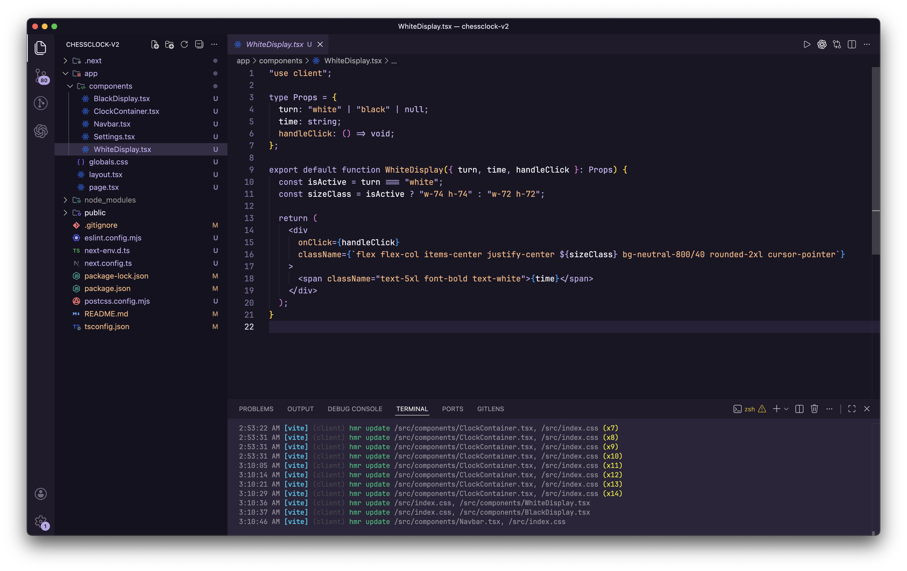

# 🌸 Min Rosé — VS Code Theme

**Min Rosé** is a Visual Studio Code theme inspired by the Min Theme and the Rosé Pine color palette.

## ✨ Overview

*A refined theme where elegance meets simplicity.*

## 📦 Installation

### From the Marketplace

1. Open VS Code or click <a href="https://marketplace.visualstudio.com/items?itemName=EricoCordeiroNeto.min-rose" target="\_blank">here</a>
2. Go to **Extensions**
3. Search for: `Min Rosé`
4. Click **Install**
5. Enjoy the theme ^^

---
